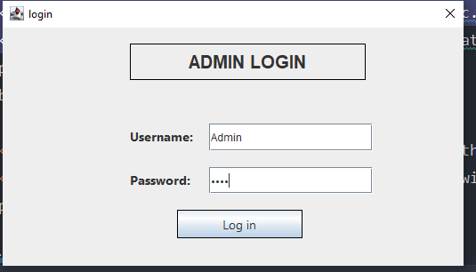
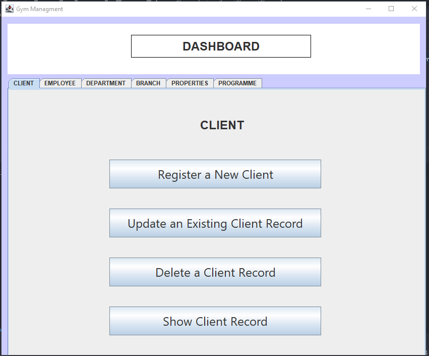
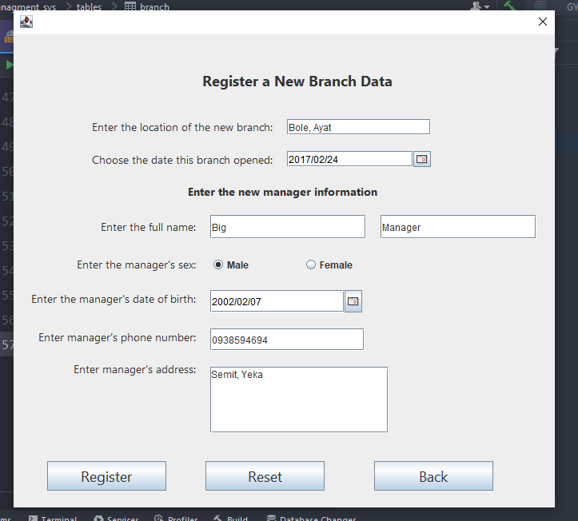
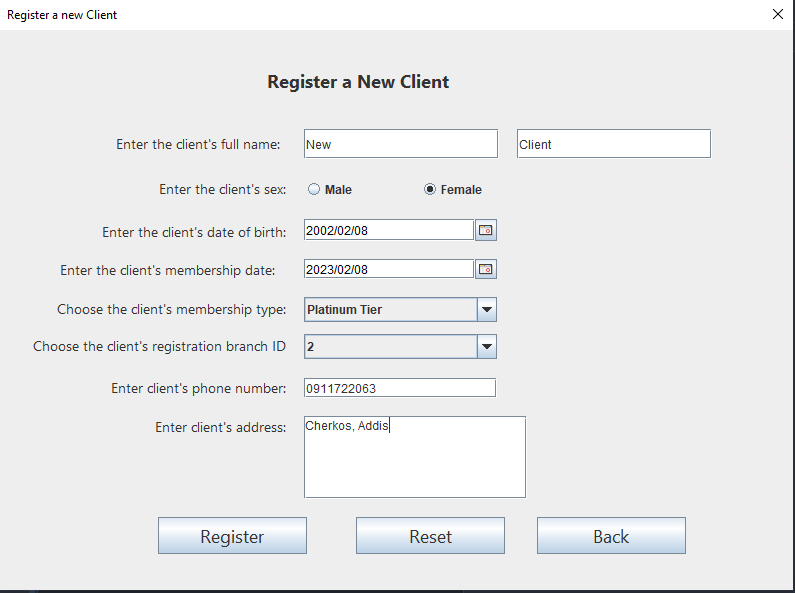
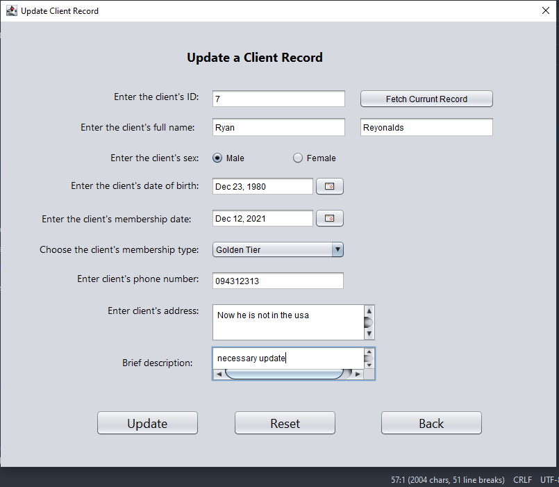
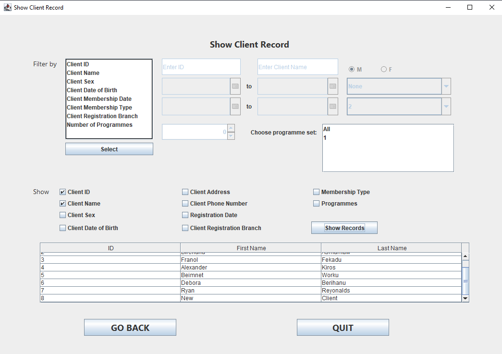
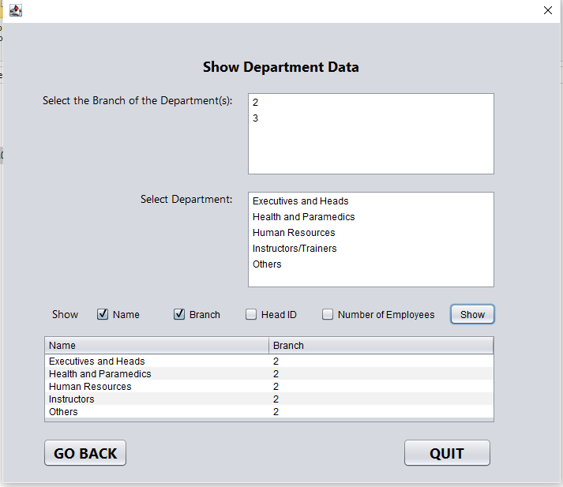
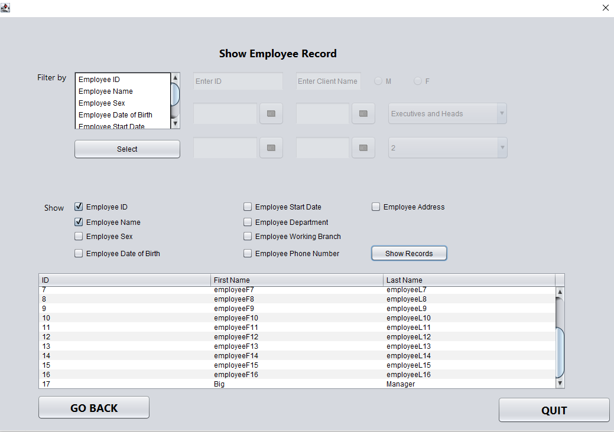
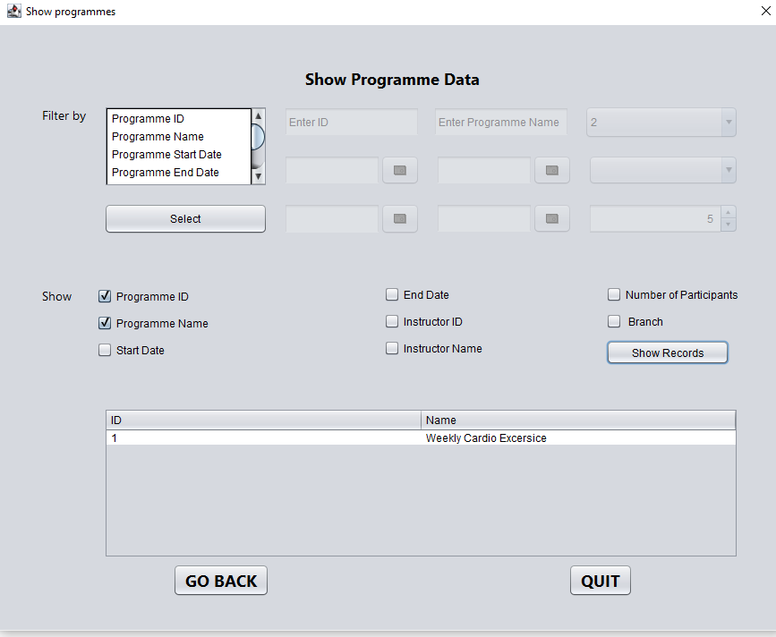

## Screenshots

&nbsp;
- Use username - "Admin" and password - "1234" to login. Make sure to add the j-calender1-4 and mysql-connector-j-8.0.31 from http://www.java2s.com/Code/Jar/j/Downloadjcalendar14jar.htm and http://www.java2s.com/Code/Jar/m/Downloadmysqlconnectorjava5119jar.htm
- This was an Object Oriented Programming using Java course Project. Here I have included screenshots of the application.  &nbsp;

  
  

&nbsp;

  
  

&nbsp;

  
  

&nbsp;

  
  

&nbsp;

  
  

